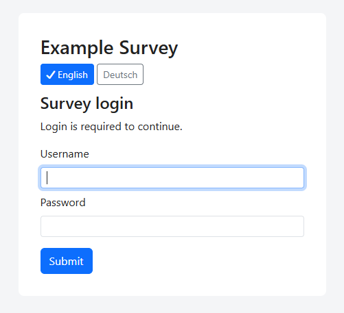
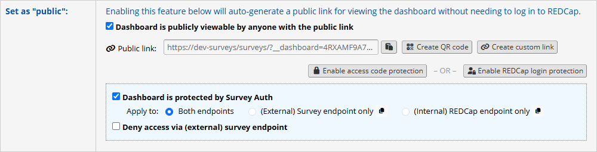

# REDCap Survey Auth

A REDCap External Module that adds authentication to surveys, public dashboards, and public reports.

See the [changelog](CHANGELOG.md) for information on release updates.

## Purpose / Use Case

In some cases it may be useful to present users with a data entry form or data (public dashboards, public reports), but not confront them with the REDCap user interface, yet still be able to tell who the person entering or viewing the data was. This way, they do not need to be members of the project or even have a REDCap account.

Possible use cases may be incident reports, internal orders/reports or requests for goods or services, etc.

## Effect

When protection is enabled for a survey (public or non-public), public dashboard, or public report, users must authenticate before accessing it. Successful login redirects directly to the protected resource.



Survey/Dashboard/Report users can be authenticated against REDCap Users (table-based authentication), any number of LDAP servers, and/or against a list of username/password entries provided in the module's project configuration.

## Requirements

This development checkout targets REDCap master and uses External Modules Framework version 12. Compatibility with older REDCap releases has not been verified for these changes.

## Installation

- Clone this repo into `<redcap-root>/modules/redcap_survey_auth_v<version-number>`, or
- Obtain this module from the Consortium REDCap Repo via the Control Center.
- Go to Control Center > Technical / Developer Tools > External Modules and enable REDCap Survey Auth.
- Enable the module for each project that needs survey authentication. Configure at least one authentication method before adding `@SURVEY-AUTH` to a survey instrument or enabling dashboard/report protection. A protected resource with no enabled authentication method rejects every login.
- For development checkouts, use the directory name `redcap_survey_auth_v9.9.9`.

## Configuration

### System-Level Settings

- **Lockout time:** The time, in (whole) minutes, a user (based on client IP) is denied further login attempts. Defaults to 5 minutes. Explicitly setting this to 0 (zero) will disable the lockout mechanism. The project-level Lockout count determines the threshold (default: 3). Failed-attempt counts are shared by client IP across projects using this module. Attempts made while locked out do not extend the deadline; successful authentication clears that IP's failed-attempt count.

### Project-Level Settings

- **Logging:** Determines which authentication attempts the module records in the project log. This setting does not disable REDCap's own page-view or data-change logging.
  - _None:_ No module authentication log entries will be produced.
  - _Failed attempts only:_ Log entries will be produced for failed login attempts only.
  - _Successful attempts:_ Log entries will be produced for successful logins.
  - _All:_ Log entries will be produced for both types of events.

- **Allow writing:** When this is enabled, the module can write data (as specified by the action tag parameters) to a (newly created) record before forwarding the user to the survey. Otherwise, the module writes no authentication metadata; REDCap can still save survey responses after authorization. The user is forwarded to the survey after successful authentication. Authentication attempts are logged according to the Logging setting, independently of Allow writing. Survey authentication logs include the submitted username, survey, instance, and outcome.

- **Text displayed above username/password fields:** Optionally enter some prompt that is displayed to the survey user.

- **Username label:** The label to be displayed for the username text box. Defaults to 'Username'.

- **Password label:** The label to be displayed for the password box. Defaults to 'Password'.

- **Submit label:** The label to be displayed on the submit button. Defaults to 'Submit'.

- **Fail message:** A message that is displayed to the user in case the login fails. Defaults to 'Invalid username and/or password or access denied'.

- **Lockout count:** Sets the number of failed login attempts that will trigger a lockout. Set to 0 to disable lockout. Default = 3.

- **Lockout message:** A message that is displayed to the user in case of too many failed login attempts. Defaults to 'Too many failed login attempts. Please try again later'.

- **Technical error message:** A message that is displayed to the user in case of a technical error that prevents completion of the authentication process. Defaults to 'A technical error prevented completion of the authentication process. Please notify the system administrator'.

- **Success message** and **Continue label:** Legacy settings retained for existing configurations. The current login flow redirects immediately and does not display either value, regardless of Allow writing.

- **Authentication methods:** Any of the following methods can be used for authentication. Authentication is attempted in this order: Custom > Table > Other LDAP > LDAP, stopping at the first successful method.

  - **Table:** REDCap verifies the username and password against its user table. Suspended accounts are denied.

  - **LDAP:** When REDCap is set to use LDAP, this is used for authentication.

  - **Other LDAP:** Provide any number of LDAP connection info as a JSON array. The order of processing will be as provided in the array. Use the connection and search parameters shown below, adapting the server, service account, base DN, and filters to your directory. The LDAP extension must be available in PHP.

    Example:

    ```JSON
    [
        {
            "url": "ldap://ldap.example.org",
            "port": 389,
            "version": 3,
            "binddn": "cn=redcap,ou=services,dc=example,dc=org",
            "basedn": "dc=example,dc=org",
            "bindpw": "bindpassword",
            "attributes": [],
            "userattr": "samAccountName",
            "userfilter": "(objectCategory=person)",
            "start_tls": true,
            "referrals": false
        }
    ]
    ```

    This example uses LDAP v3 with StartTLS; the server must support it and PHP must trust its certificate.

  - **LDAP Attribute mappings:** When LDAP is enabled, custom attribute mappings for email, first, last, and full name can be set. These will be used when attempting to get email and full name of an authenticated user.

  - **Fall back to retrieving user information from REDCap's user table when no values are obtained from LDAP attributes:** After successful LDAP authentication, any missing email or full name is filled from the REDCap user table for the submitted username. Values already obtained from LDAP are retained. This does not authenticate against the REDCap table or create a REDCap account.

  - **Custom:** When selected, custom credentials can be entered into a text box. Type one username-password pair per line, separated by a colon (e.g. `UserXY:secret123`). Usernames are not case-sensitive (passwords are).

- **Use Allowlist:** When checked, a list of usernames (one username per line) can be entered. Only users in this list will be able to authenticate successfully. Matching is case-insensitive; an enabled empty allowlist denies everyone.

- **Public Dashboard Access Denied Message:** Allows to set a custom message to be displayed when access to a public dashboard is denied.

- **Public Report Access Denied Message:** Allows to set a custom message to be displayed when access to a public report is denied.

### @SURVEY-AUTH Action Tag

To enable authentication for a survey, the **@SURVEY-AUTH** action tag must be used on any field of the survey instrument. There must be at most one action tag per instrument.

```ActionTag
@SURVEY-AUTH(success=value, username=fieldname, email=fieldname, fullname=fieldname, timestamp=fieldname)
```

When _username_, _email_, _fullname_, or _timestamp_ are defined, the corresponding data will be inserted into the specified fields when Allow writing is enabled (timestamp format will match the datetime format of the target field; time-only fields are not supported; the default date format is YMD).

When a value for _success_ is defined, the field with the action tag will be set to this value when Allow writing is enabled; no additional mapping is required. If used, the field should likely be set to @READONLY/@READONLY-SURVEY or @HIDDEN-SURVEY.

### Combining **@SURVEY-AUTH** with **@IF**

The **@SURVEY-AUTH** action tag can be used inside **@IF** action tags. Note that in public surveys, at the time of evaluation, the record does not exist yet, and thus any logic should be restricted to record-independent elements, such as e.g. the [arm-number], [arm-label] or the aggregate smart variables.


## Public Dashboards and Reports

When editing an existing Project Dashboard or Report that is publicly accessible, additional protection options are shown:

- The option to protect a dashboard or report with a login screen (_Dashboard/Report is protected by Survey Auth_).  

In REDCap installations that use a separate endpoint for surveys, additional options are available:

- The option to require login for both endpoints or only for the (external) survey endpoint or the (internal) REDCap endpoint.
- The option to deny access to public dashboards/reports when accessed via the (external) survey endpoint. The message that is displayed in such a case can be set in the module's project level configuration.



Endpoint selection uses the configured scheme, hostname, port, and base path. Internal and external URLs can share a hostname if their base paths differ; the more specific matching path takes precedence. Requests matching neither configured endpoint are denied. Denying external access takes precedence over login protection, including for users who already authenticated.

Dashboard copies inherit the source dashboard's SurveyAuth settings. Copies remain private until those settings are saved, and become public only if REDCap's publication rules permit it. REDCap copies reports as non-public; review protection when making a copied report public.

## Authentication sessions

Authorization is stored in the REDCap survey session for the browser making the request. Sharing a survey, dashboard, or report URL does not share authorization. Old URL authentication tokens and calendar-day dashboard/report session flags are no longer accepted.

- Login forms expire after 10 minutes. Reopen the resource to obtain a fresh form.
- Authorization expires after 30 minutes without authorized activity or 8 hours after login, whichever comes first. REDCap session expiry or loss of the session cookie can end access earlier.
- Survey authorization is scoped to the survey response and repeat instance. Public starts are kept separate; Save & Return still requires REDCap's return-code validation and SurveyAuth authorization.
- Dashboard and report authorization is scoped to the individual resource and endpoint. Logging into one does not authorize another.
- Protection-setting changes invalidate existing authorization. Table-authenticated sessions also recheck account suspension and password changes. LDAP credentials are checked at login, not on each subsequent request.

SurveyAuth gates access to survey file routes; REDCap retains responsibility for native file handling after authorization.
