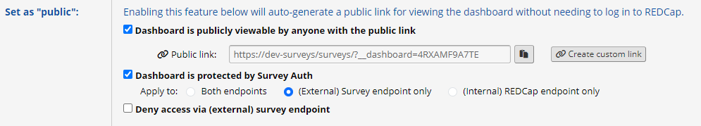

# REDCap Survey Auth

A REDCap External Module that adds authentication to surveys, public dashboards, and public reports.

See the [changelog](CHANGELOG.md) for information on release updates.

## Purpose / Use Case

In some cases it may be useful to present users with a data entry form or data (public dashboards, public reports), but not confront them with the REDCap user interface, yet still be able to tell who the person entering or viewing the data was. This way, they do not need to be members of the project or even have a REDCap account.

Possible use cases may be incident reports, internal orders/reports or requests for goods or services, etc.

## Effect

When enabled for a survey (public or non-public), public dashboard, or public report, a login page will be displayed as first page of a survey that the user needs to complete before being able to proceed to the page (similar to the reCAPTCHA feature).


Survey/Dashboard/Report users can be authenticated against REDCap Users (table-based authentication), any number or LDAP servers, and/or against a list or username/password entries provided in the module's project configuration.

## Requirements

REDCap 13.1.0 Standard / REDCap 13.1.5 LTS or newer.

## Installation

- Clone this repo into `<redcap-root>/modules/redcap_survey_auth_v<version-number>`, or
- Obtain this module from the Consortium REDCap Repo via the Control Center.
- Go to Control Center > Technical / Developer Tools > External Modules and enable REDCap Survey Auth.
- Enable the module for each project that needs survey authentication. Be sure to include the action tag @SURVEY-AUTH somewhere in the survey instrument and to configure the module's project settings (authentication is deactivated with the default settings).

## Configuration

### System-Level Settings

- **Lockout time:** The time, in (whole) minutes, a user (based on client IP) is denied further login attempts. Defaults to 5 minutes. Explicitly setting this to 0 (zero) will disable the lockout mechanism. The lockout occurs after 3 failed attempts.

### Project-Level Settings

- **Logging:** Determines the type of logging that occurs.
  - _None:_ No log entries will be produced.
  - _Failed attempts only:_ Log entries will be produced for failed login attempts only.
  - _Successful attempts:_ Log entries will be produced for successful logins.
  - _All:_ Log entries will be produced for both types of events.

- **Allow writing:** When this is enabled, the module can write data (as specified by the action tag parameters) to a (newly created) record before forwarding the user to the survey. Otherwise, no data is written to the record and the user is simply forwarded to the survey after successful authentiation. In any case, authentication is logged to the events table.

- **Text displayed above username/password fields:** Optionally enter some prompt that is displayed to the survey user.

- **Username label:** The label to be displayed for the username text box. Defaults to 'Username'.

- **Password label:** The label to be displayed for the password box. Defaults to 'Password'.

- **Submit label:** The label to be displayed on the submit button. Defaults to 'Submit'.

- **Fail message:** A message that is displayed to the user in case the login fails. Defaults to 'Invalid username and/or password or access denied'.

- **Lockout count:** Sets the number of failed login attempts that will trigger a lockout. Set to 0 to disable lockout. Default = 3.

- **Lockout message:** A message that is displayed to the user in case of too many failed login attempts. Defaults to 'Too many failed login attempts. Please try again later'.

- **Technical error message:** A message that is displayed to the user in case of a technical error that prevents completion of the authentication process. Defaults to 'A technical error prevented completion of the authentication process. Please notify the system administrator'.

- **Success message** and **Continue label:** A message and button label that are displayed to the user after successful authentication. This is only relevant when writing by the module is allowed (see above).

- **Authentication methods:** Any of the following methods can be used for authentication. Note the order, in which authentication is attempted: Custom > Table > Other LDAP > LDAP.

  - **Table:** The REDCap user table is used to look up user/password combinations.

  - **LDAP:** When REDCap is set to use LDAP, this is used for authentication.

  - **Other LDAP:** Provide any number of LDAP connection info as a JSON array. The order of processing will be as provided in the array. See the [PEAR manual for the LDAP auth container](https://pear.php.net/manual/en/package.authentication.auth.storage.ldap.php) for a list of parameters (_debug_ is not supported) or the LDAP configuration in REDCap's `webtoolsl2/ldap` folder.

    Example:

    ```JSON
    [
        {
            "url": "ldap://127.0.0.1",
            "port": 389,
            "version": 3,
            "binddn": "bindUsername",
            "bindpw": "bindpassword",
            "attributes": [],
            "userattr": "samAccountName",
            "userfilter": "(objectCategory=person)",
            "start_tls": false,
            "referrals": false
        }
    ]
    ```

  - **LDAP Attribute mappings:** When LDAP is enabled, custom attribute mappings for email, first, last, and full name can be set. These will be used when attempting to get email and full name of an authenticated user.

  - **Fall back to retrieving user information from REDCap's user table when no values are obtained from LDAP attributes:** When enabled and full name or  Fall back to retrieving user information from REDCap's user table when no values are obtained from LDAP attributes

  - **Custom:** When selected, custom credentials can be entered into a text box. Type one username-password pair per line, separated by a colon (e.g. `UserXY:secret123`). Usernames are not case-sensitive (passwords are).

- **Use Allowlist:** When checked, a list of usernames (one username per line) can be entered. Only users in this list will be able to authenticate successfully.

- **Public Dashboard Access Denied Message:** Allows to set a custom message to be displayed when a access to a public dashboard is denied.

- **Public Report Access Denied Message:** Allows to set a custom message to be displayed when a access to a public report is denied.

### @SURVEY-AUTH Action Tag

To enable authentication for a survey, the **@SURVEY-AUTH** action tag must be used on any field of the survey instrument. There must be at most one action tag per instrument.

```ActionTag
@SURVEY-AUTH(success=value, username=fieldname, email=fieldname, fullname=fieldname, timestamp=fieldname)
```

When _username_, _email_, _fullname_, or _timestamp_ are defined, the corresponding data will be inserted the specified fields (timestamp format will match the datetime format of the target field; time-only fields are not supported; the default date format is YMD).

When a value for _success_ is defined, the field with the action tag will be set to this value. If used, the field should likely be set to @READONLY/@READONLY-SURVEY or @HIDDEN-SURVEY.

### Combining **@SURVEY-AUTH** with **@IF**

The **@SURVEY-AUTH** action tag can be used inside **@IF** action tags. Note that in public surveys, at the time of evaluation, the record does not exist yet, and thus any logic should be restricted to record-independent elements, such as e.g. the [arm-number], [arm-label] or the aggregate smart variables.


## Public Dashboards and Reports

When editing a Project Dashboard or Report that is set to be publicly accessible, additionl protection options are shown when editing an existing dashboard:
- The option to protect a dashboard or report with a login screen (_Dashboard/Report is protected by Survey Auth_).  

In REDCap installations that use a separate endpoint for surveys, additional options are available:
- The option to require login for both endpoints or only for the (external) survey endpoint or the (internal) REDCap endpoint.
- The option to deny access to public dashboards/reports when accessed via the (external) survey endpoint. The message that is displayed in such a case can be set in the module's project level configuration.



Once authenticated, a cookie will allow access to the dashboard/report for the remainder of the (calendar) day.
