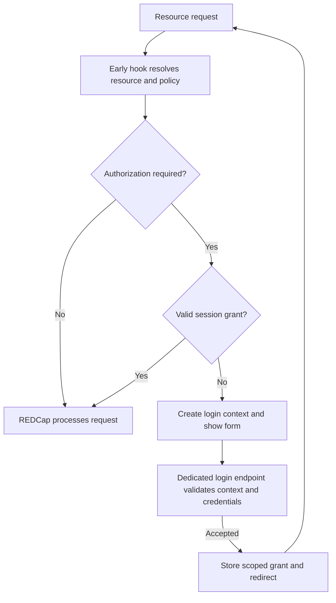

# Implementation guide

This guide describes the current implementation of Survey Auth. For configuration and participant-visible behavior, see the [README](../README.md). For changes and verification, see the [maintenance guide](maintenance.md).

## Responsibilities and source map

Survey Auth decides whether a browser session may access a configured survey, public dashboard, or public report. REDCap continues to own survey processing, response storage, return codes, and native file handling. Authentication against a directory does not make the participant a REDCap project user.

| Source | Responsibility |
| --- | --- |
| [SurveyAuthExternalModule.php](../SurveyAuthExternalModule.php) | Hook dispatch, resource settings, dashboard copying, authentication backends, metadata writes, lockout storage, migrations |
| [SurveySessionAuth.php](../classes/SurveySessionAuth.php) | Survey identity resolution, request authorization, login contexts, session grants, continuation and completion |
| [PublicResourceAuth.php](../classes/PublicResourceAuth.php) | Dashboard/report identity, endpoint policy, scoped authorization and login completion |
| [SurveyAuthSettings.php](../classes/SurveyAuthSettings.php) | Configuration defaults and normalized authentication settings |
| [SurveyAuthInfo.php](../classes/SurveyAuthInfo.php) | Action-tag parameters and metadata mappings |
| [survey-login.php](../survey-login.php) | Compatibility endpoint for previously opened native login forms |
| [session-login.php](../html/session-login.php), [survey-login.js](../js/survey-login.js) | Shared AJAX login form, errors and redirect |
| [config.json](../config.json) | Framework version, endpoint registration, configuration UI and action tag |

## Request and login flow

Explicit access denial and invalid or ambiguous contexts stop the request rather than proceeding through the diagram's unprotected branch.

`redcap_every_page_before_render` checks authorization before ordinary survey submission processing. It also handles public-resource requests and supported direct file routes. Its name alone is not evidence of its position relative to core writes: that ordering is an integration dependency.

Core page-view logging precedes the early hook. The login form uses `JSMO.ajax('survey-login', payload)` through the framework's `surveys/?__passthru=ExternalModules` endpoint, which core excludes from page-view POST logging. The module's early gate lets its own framework AJAX requests reach framework dispatch; ordinary survey processing and other modules' requests retain their existing authorization checks. The framework validates CSRF, encrypted request context and the registered no-auth action before calling the module. The module additionally validates its session-bound login context/CSRF and matching project, then re-resolves resource identity and policy before issuing a grant. Errors return as data; failed credentials rotate session CSRF for the next attempt. Success returns a same-origin redirect. Neither core nor web-server configuration changes are required.

Login uses the participant's REDCap survey session. Session initialization checks the expected session name; it does not transfer a staff session into a participant session. Redirects use validated paths on the participant's current origin. Login requires JavaScript. Inputs have no native submission names, and the submit button stays disabled until initialization, so a failed script cannot submit credentials through ordinary survey processing. A no-JavaScript notice explains how to continue. Passwords are serialized once and cleared from the object retained by the framework AJAX queue, whose transport-error logging may otherwise expose payload properties. Each login context retains the framework CSRF token embedded in that tab. Before framework AJAX dispatch, the module may use that token as the request-local cookie value only after matching both it and the independent login CSRF against the live context in the same survey session. This handles the framework's browser-wide cookie rotation without changing browser cookies, framework code, or signed-request verification. Expired/consumed contexts and tokens from another session cannot use this path.

## Session state and identity

The module stores `logins` and `grants` under `redcap_survey_auth_v2` in the REDCap survey session. A login context contains navigation and authorization scope, a policy revision, CSRF value, and expiry. Survey grants also retain the exact authentication field values successfully written at login, for restoration after Start over. It does not retain the password or submitted survey answers/uploads.

| State | Lifetime |
| --- | --- |
| Pending login context | 10 minutes |
| Return-entry grant awaiting response selection | 10 minutes |
| Ordinary resource/survey grant | 30 minutes idle, at most 8 hours from login |

REDCap session expiry or loss of the session cookie can end authorization earlier. The state is bounded to 16 pending contexts and 32 grants. These are implementation limits, not configuration settings.

Survey identity is resolved from REDCap's survey, participant, and response records. A continuation may use a response hash validated by core; Save & Return uses core return-code resolution. Posted record IDs are not an authorization source. Scope distinguishes project, survey, event, instrument, response/record and repeat instance.

Before a public response exists, a session-bound flow identifier separates starts in different tabs. The identifier has no authority without its matching session grant. `redcap_survey_page_top` adds navigation fields only; it is not the authorization gate.

After an authorized save, `redcap_save_record` binds the confirmed response to a continuation grant. It consumes a request-local authorization decision and checks the hook's scope. `redcap_survey_complete` removes the matching response grant. A grant for one response or repeat instance is not project-wide authorization.

REDCap's Start over clears data directly without invoking the ordinary save hook. The early gate authorizes the reset and binds its response ID to the validated response hash. At `redcap_survey_page_top`, the module verifies the same record/event/instrument/instance and confirms that core cleared the response status, then restores only the authentication values retained in the grant through the same metadata writer used at login. It reloads the response without the reset parameter because core already built the form with cleared values. Original username, directory attributes and timestamp are preserved; no new authentication event or record is created. Allow writing off prevents restoration. A restoration failure stops rendering, revokes the grant and requests reauthentication. Older grants without a value snapshot require reauthentication before the reset can run.

REDCap's completion page destroys the entire native survey session after the completion hook. Consequently, completing a survey in one tab also ends authorization in other tabs sharing that session. The module does not recreate authorization after core destroys the session; another protected tab must reauthenticate, and an in-flight answer submission is blocked without replay. Saving an intermediate page does not invoke this core completion cleanup.

Policy revisions include loaded settings and, for surveys, the data dictionary. Changes can require fresh login. Table-authenticated grants additionally check account suspension and a revision derived from password/salt storage. LDAP credentials are checked at login, not continuously against the directory.

If authorization expires during a POST, the module blocks the write and reports that the submission was not saved. It does not automatically preserve or replay answers or uploads. Reauthentication reopens the survey; browser recovery of unsaved input is not guaranteed.

## Public dashboards and reports

The module resolves a public resource by project, type and public hash. Its grant includes resource ID, hash and endpoint. Logging into a dashboard does not authorize a report or another dashboard.

Endpoint classification compares configured scheme, hostname, port and base-directory path. The most specific matching directory wins when bases overlap. An unmatched request fails closed. Explicit external-access denial takes precedence over an existing login grant.

Protection settings are stored per resource ID. The dashboard copy handler uses core's copy method with a private source snapshot, writes the three destination protection settings, then restores public visibility only when core publication rules permit it. This ordering matters because the core copy method manages its own transaction. A failed settings copy must leave the destination private. Staff design rights, core CSRF handling, and core-compatible response output are retained.

Core report copies are non-public. Protection must be reviewed when a copied report is subsequently published.

## Authentication, writes and logs

Both authentication flows use one dispatcher: Custom, Table, Other LDAP, then REDCap LDAP. Processing stops at the first accepted backend. Each attempt owns its result; unaccepted directories must not contribute identity attributes to another method's success.

Custom credentials use exact password comparison and normalized usernames. Table authentication checks account availability and suspension before password verification. LDAP supports configured search scopes, group restrictions, attribute mapping and optional fallback for missing email/full name. Attribute names are matched case-insensitively and submitted UTF-8 usernames are preserved. REDCap user-table fallback supplies missing attributes only after LDAP authentication succeeds.

With Allow writing enabled, action-tag mappings may write authentication metadata. A success-only assignment is sufficient; the record ID is not a writable mapping target. Save results must have no errors, and new records must have a returned ID before completion produces a destination. Repeating events and forms use the appropriate REDCap data structure. Return-entry authentication defers these writes until the response is known.

The Logging setting selects successful and/or failed authentication events. Survey entries include the submitted username, survey and instance, with project/event/record context. A submitted identity in a failure entry is not a verified identity. Passwords are never intentional log fields. REDCap's own logging is independent of the module's Logging setting.

Lockout counters are shared by `REMOTE_ADDR` across projects; each project supplies its threshold. A system setting supplies the duration. Checks do not extend the deadline, and successful authentication clears the address's counter. Updates use a MySQL advisory lock and primary-connection reads around the stored JSON read/modify/write operation. Framework setting helpers perform writes; direct core queries are used where explicit primary-connection control is required.

## Settings lifecycle

System enable/version-change and project enable hooks run state-based, repeatable migrations. System cleanup discovers retained project settings even where the module is disabled. Project enable also handles values imported or restored later.

Retired forwarding settings are removed through framework helpers. The older token-to-Allow writing transition preserves an explicit writing choice. Migration decisions depend on stored state, not numeric version arithmetic. See the README's retired-settings section for rollback implications.
